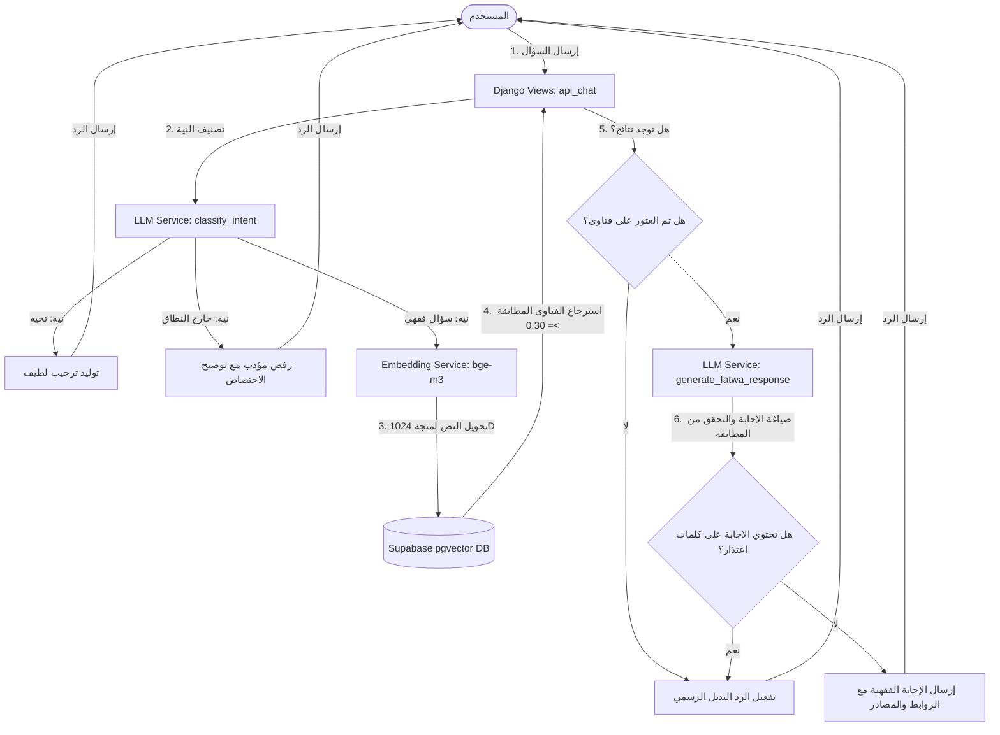

# دار الإفتاء الليبية - المساعد الفقهي الذكي (RAG Chatbot)

هذا المشروع عبارة عن مساعد فقهي ذكي قائم على الويب، تم بناؤه باستخدام إطار العمل **Django** وقاعدة بيانات **Supabase** المزودة بملحق متجهات **pgvector**، ونظام نماذج اللغة والذكاء الاصطناعي **Cloudflare Workers AI**. يتيح النظام للمستخدمين طرح أسئلتهم الفقهية والشرعية والبحث الفوري عنها ضمن أرشيف فتاوى دار الإفتاء الليبية الموثقة.

---

## 🏗️ بنية المشروع المعمارية (Architecture)

يتكون النظام من أربعة مكونات أساسية تعمل بتكامل تام:



---

## 📂 الهيكل التنظيمي للمشروع (Directory Structure)

```text
dar alifta rag bot/
│
├── config/                  # إعدادات مشروع Django العام
│   ├── settings.py          # تكوين خوادم الاتصال والربط والـ Logging
│   ├── urls.py              # مسارات الروابط الأساسية للمشروع
│   └── wsgi.py / asgi.py    # بوابات تشغيل الويب
│
├── chatbot/                 # تطبيق المساعد الفقهي
│   ├── templates/
│   │   └── chatbot/
│   │       └── index.html   # واجهة الويب الأمامية (Premium Dark Theme)
│   ├── services/            # الخدمات البرمجية الأساسية (Integrations)
│   │   ├── __init__.py
│   │   ├── embedding.py     # توليد متجهات النصوص عبر Cloudflare BGE-M3
│   │   ├── supabase_db.py   # الاستعلام المطابق لـ pgvector في Supabase
│   │   └── llm.py           # الربط مع Llama 4 Scout للتوجيه وصياغة الأجوبة
│   ├── views.py             # منسق العمليات الرئيسي (Orchestrator)
│   └── urls.py              # روابط واجهة التطبيق والـ API الخاصة بالدردشة
│
├── scratch/                 # نصوص برمجية للاختبار والتحقق
│   ├── test_prompt.py       # اختبار مباشر لموديل Llama 4 Scout
│   └── test_views.py        # اختبار متكامل لدورة حياة الطلب والـ View
│
├── venv/                    # البيئة الافتراضية للغة بايثون (Python Virtual Environment)
├── .env                     # ملف متغيرات البيئة السرية (API Keys & URLs)
├── db.sqlite3               # قاعدة بيانات Django المحلية للمهام العامة
└── manage.py                # أداة التحكم والتطوير في Django
```

---

## ⚙️ متطلبات الإعداد والتشغيل (Setup & Run)

### 1. إعداد متغيرات البيئة (`.env`)
يجب إنشاء ملف باسم `.env` في جذر المشروع يحتوي على التكوينات التالية:
```env
CF_ACCOUNT_ID=your_cloudflare_account_id
CF_API_TOKEN=your_cloudflare_api_token
SUPABASE_URL=https://your_project.supabase.co
SUPABASE_KEY=your_supabase_anon_or_service_role_key
```

### 2. تفعيل البيئة الافتراضية
في نظام Windows PowerShell:
```powershell
.\venv\Scripts\Activate.ps1
```

### 3. تثبيت الاعتماديات (Dependencies)
تأكد من تثبيت الحزم المطلوبة:
```bash
pip install django supabase python-dotenv requests markdown
```

### 4. تشغيل خادم التطوير المحلي
قم بتشغيل الأمر التالي لبدء تشغيل الموقع محلياً:
```bash
python manage.py runserver 0.0.0.0:8000
```
سيكون الموقع متاحاً على الرابط: [http://127.0.0.1:8000](http://127.0.0.1:8000)

---

## 🛠️ تفاصيل دورة حياة الطلب (Request-Response Workflow)

عند كتابة المستخدم رسالة وإرسالها، يمر الطلب بالخطوات الفقهية والتقنية التالية:

### الخطوة 1: استقبال الرسالة وتصنيف النية
تستقبل دالة `api_chat` في [views.py](file:///c:/Users/HP/Desktop/projects/dar%20alifta%20rag%20bot/chatbot/views.py) الطلب. يتم إرسال الرسالة إلى دالة `classify_intent` في [llm.py](file:///c:/Users/HP/Desktop/projects/dar%20alifta%20rag%20bot/chatbot/services/llm.py) لتصنيفها إلى واحدة من ثلاث فئات:
*   **`GREETING`**: تحيات ومجاملات (مثل "السلام عليكم"). يتم الرد عليها فوراً بترحيب رسمي لطيف وموجه يوضح كيفية المساعدة دون الاتصال بقاعدة البيانات.
*   **`OUT_OF_SCOPE`**: أسئلة عامة خارج الفقه (مثل أسعار الذهب، الطقس، الرياضيات، البرمجة). يقوم النظام فوراً برفض الإجابة عنها بأدب واعتذار رسمي يوضح تخصص البوت الفقهي.
*   **`FATWA_QUERY`**: سؤال شرعي فقهي. يتم تمريره للمرحلة التالية للبحث الفقهي.

### الخطوة 2: توليد متجه البحث (Vectorization)
يتم إرسال السؤال الفقهي إلى نموذج `@cf/baai/bge-m3` عبر [embedding.py](file:///c:/Users/HP/Desktop/projects/dar%20alifta%20rag%20bot/chatbot/services/embedding.py) لتوليد متجه رقمي مكون من **1024 بعداً** يمثل المعنى الدلالي للسؤال.

### الخطوة 3: بحث التطابق الدلالي (pgvector RPC)
يستدعي النظام دالة مخزنة في قاعدة بيانات Supabase تسمى `match_fatwas` مع المعاملات التالية:
*   `query_embedding`: المتجه الرقمي الممثل للسؤال.
*   `match_threshold`: تم ضبطه عند `0.30` لضمان استرجاع الفتاوى القريبة دلالياً حتى مع وجود أخطاء إملائية.
*   `match_count`: تم ضبطه عند `4` لضمان إحاطة جيدة بالسياق دون استهلاك كامل لرموز (Tokens) نموذج الإجابة.

### الخطوة 4: التحقق الفقهي وصياغة الإجابة
*   **في حال عدم العثور على أي فتوى متطابقة (0 فتاوى مسترجعة)**:
    يتم تفعيل الرد البديل الرسمي الفوري:
    > *"عذراً، لم أتمكن من العثور على فتوى مسجلة ومطابقة لسؤالك في قاعدة بيانات دار الإفتاء الحالية. يرجى صياغة السؤال بشكل مختلف أو استشارة أحد المفتين مباشرة."*
*   **في حال العثور على فتاوى متطابقة**:
    يتم تضمين نصوص الفتاوى والروابط ومستويات التطابق في سياق صارم ومحكم، وتُرسل لنموذج الذكاء الاصطناعي `@cf/meta/llama-4-scout-17b-16e-instruct` مع تعليمات صارمة تمنعه من تأليف أو استنباط أي أحكام من معرفته العامة.

### الخطوة 5: المعالجة اللاحقة والتحقق من الإجابة (Post-Processing)
تقوم دالة `api_chat` بفحص الرد المستلم من نموذج الذكاء الاصطناعي:
*   إذا كان الرد يحتوي على كلمات دلالية تدل على عدم كفاية السياق للإجابة (مثل: "عذراً"، "لم أجد"، "لا يوجد"، "لا تحتوي")، يتم تجاوز رد النموذج بالكامل واستبداله **بالرد البديل الرسمي** لضمان عدم تمرير إجابات فقهية مشوهة أو غير دقيقة.
*   إذا نجح النموذج في صياغة الإجابة بناءً على السياق، يتم إرسال الإجابة مباشرة مع قائمة المصادر والروابط الخاصة بكل فتوى مستند إليها.

---

## 🎨 واجهة المستخدم (UI/UX Design)
تتميز الواجهة بتصميمها الراقي ذو الطابع الإسلامي الحديث:
*   **الألوان**: خلفية داكنة فاخرة ممزوجة بظلال خضراء وذهبية إسلامية دافئة.
*   **الخطوط**: تستخدم خطوطاً عربية ممتازة مثل **Cairo** و **Amiri** لراحة تامة في القراءة والاطلاع الفقهي.
*   **المرونة**: تدعم الشاشات الكاملة والتصفح عبر الهواتف الذكية مع شاشة ترحيب في المركز تعرض 4 أسئلة استرشادية لتسهيل الاستخدام الأولي.
*   **معالجة الروابط**: تم دمج معالج متطور ومثالي لروابط Markdown لفتحها في تبويبات منفصلة تلقائياً وتفادي الأخطاء البرمجية في المتصفح.
